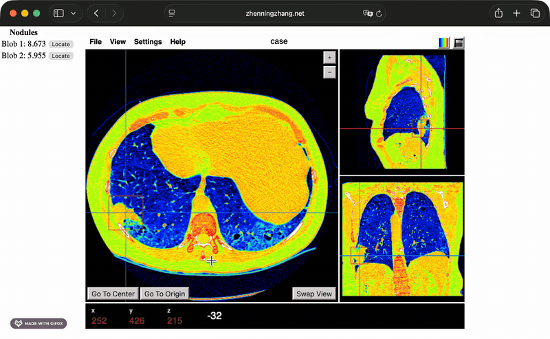
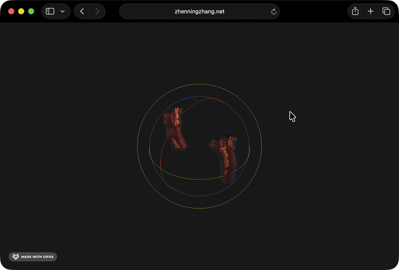

::: {.eyebrow}
§ AstraZeneca · 2019 – present
:::

Drug discovery ML, medical imaging and segmentation, and the tooling and
infrastructure that supports both. Grouped by thread, most recent work
first inside each.

## Drug Discovery ML

::: {.work-entry}

2024 – Present

### Multimodal IC50 prediction
PyTorch models fusing cell painting microscopy with SMILES chemical
representations for compound activity prediction. Deployed across compound
libraries totaling 39K compounds; jointly learned image-and-structure
embeddings inform downstream phenotype-to-target reasoning.

[Read more →](projects/ic50-multimodal.qmd)

:::

::: {.work-entry}

2021 – 2022

### Graph-based analysis of multiplex immunofluorescence
Graph Neural Networks over multi-channel images, capturing spatial
cell-cell relationships in multiplex IF for downstream phenotype
classification. Preprint on bioRxiv; abstracts at SITC and AACR.

[Read more →](projects/multiplex-if-gnn.qmd) ·
[Preprint — bioRxiv](https://www.biorxiv.org/content/10.1101/2021.06.09.447654v1){.external}

:::

## Medical Imaging & Segmentation

::: {.work-entry}

2026 · AACR poster

### Automatic contrast phase classification of polyphasic CT scans
Deep learning classifier inferring contrast phase from CT volumes — a
prerequisite for downstream tumor segmentation pipelines that depend on
consistent imaging protocol. Co-authored work, poster at AACR 2026.

[Read more →](projects/aacr-2026-contrast-classification.qmd) ·
[Abstract — AACR 2026](https://aacrjournals.org/cancerres/article/86/7_Supplement/2777/778083/Abstract-2777-Automatic-contrast-phase){.external}

:::

::: {.work-entry}

2023 – Present

### Interactive 3D segmentation toolset
Transformer-backed segmentation tool for 3D volumetric data with
text-guided prompts. Halved annotation time and deployed to twelve
internal users across R&D. Companion paper as poster at AACR 2024.

[Read more →](projects/segmentation-toolkit.qmd) ·
[Abstract — AACR 2024](https://aacrjournals.org/cancerres/article/84/6_Supplement/887/741446){.external}

:::

## Tooling & Infrastructure

::: {.work-entry}

2022 – Present

### Biomedical imaging data platform
Unified ingestion and preprocessing platform for biomedical imaging at
scale — now the team's standard data layer. Sixteen multi-center datasets,
150K CT volumes, automated mapping of thousands of annotation masks across
DICOM and NIfTI standards.

[Read more →](projects/data-ingestion-platform.qmd)

:::

::: {.work-entry}

2022 – Present

### Embedding visualization toolkit
Web-based visualization suite for high-dimensional embedding
interpretation — clustering (HDBSCAN over UMAP), heatmaps, histograms,
archetype analysis. Used by R&D labs across several modeling projects.

[Read more →](projects/embedding-visualization.qmd)

:::

::: {.eyebrow style="margin-top: 3.5rem;"}
§ Ann Arbor Algorithms · 2018 – 2019
:::

Software Engineer building containerized end-to-end deep learning
pipelines for medical imaging — classification, 3D bounding-box detection,
and anomaly identification across multimodal datasets at scale.

::: {.work-entry}

2020 · Patterns (Cell Press)

### Microcalcification detection in mammography
End-to-end deep learning detection of microcalcifications using a U-Net
architecture, with downstream localization of asymmetric patterns. The
work was peer-reviewed and published in *Patterns* — Guan, Wang, Li,
**Zhang**, Chen, Siddiqui, Nehring, Huang. *Detecting asymmetric patterns
and localizing cancers on mammograms.* Patterns 1, no. 7 (2020).

[Read more →](projects/microcalcification-mammography.qmd) ·
[Paper — Patterns DOI](https://www.cell.com/patterns/fulltext/S2666-3899(20)30140-9){.external}

:::

Other work at AAA:

- **Chest vessel segmentation** — 3D deep learning for atherosclerosis
  identification on chest MRI.
- **Integrated tumor segmentation** — Dockerized lung-cancer segmentation
  with 3D visualization.
- **Lung cancer prediction** — XGBoost over patient metadata
  (1,658 patients).
- **ECG abnormality identification** — ResNet variant for 12-lead ECG
  analysis (7,191 samples).
- **Colorectal surgical phase detection** — video and sensor-based phase
  prediction.

## Demos

AZ work is largely confidential. These demos from earlier work at Ann Arbor
Algorithms remain publicly viewable.

::: {.work-entry}

Dash · 2018 – 2019

### Patient Info — disease prediction dashboard

[ demo gif placeholder ]

Integrated dashboard for displaying lung-disease predictions and patient
metadata. Built in Dash; produced from real data with a placeholder ECG
panel due to data availability constraints.

Live demo — relinking to new host.

:::

::: {.work-entry}

DICOM viewer · 2018 – 2019

### Papaya — lung-nodule DICOM viewer

Dockerized lung-cancer nodule detection with 3D DICOM visualization. Volumes
load slowly — expect 1–2 minutes per case after click. Case 1 is the
smallest and quickest to load.

[Case 1](assets/papaya/papaya_5c4c25f93529bf21469f81a0acd5d324/) ·
[Case 2](assets/papaya/papaya_7f1d2088b4244395b72eb8287f66a295/) ·
[Case 3](assets/papaya/papaya_85746d90494345e38ab61533e999b3f1/) ·
[Case 4](assets/papaya/papaya_37e90452caa5924546f33804040fc858/)

:::

::: {.work-entry}

three.js · 2018 – 2019

### Plaque — chest-vessel atherosclerosis 3D viewer

Interactive three.js viewer for chest-vessel classification and
atherosclerosis detection. Two cases included.

[Live demo](assets/plaque/)

:::

For personal projects and side builds, see [Tinkering](experiments.qmd).
