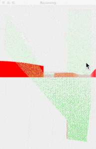

::: {.eyebrow}
Personal project
:::

## Idea

Raycasting renders a faux-3D scene from a 2D map by casting rays per
pixel column and computing wall heights from intersection distance. It is
the technique behind *Wolfenstein 3D* (1992), and a fun rendering
algorithm to implement from scratch.

## Implementation

Python 3 with PyQt5 for the rendering surface. The map is a 2D grid; rays
are cast at the column resolution of the viewport; wall heights and
shading derive from the per-ray intersection distances.

## Stack

Python 3, PyQt5.

[GitHub repository →](https://github.com/mizaimao/raycasting_pyqt){.external}
