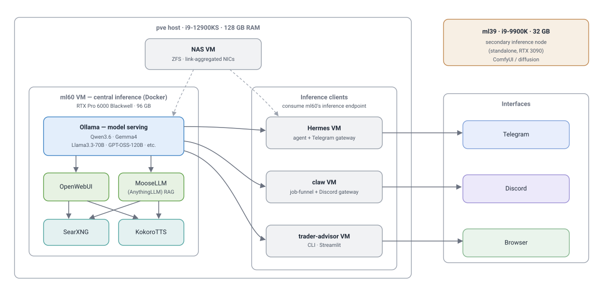
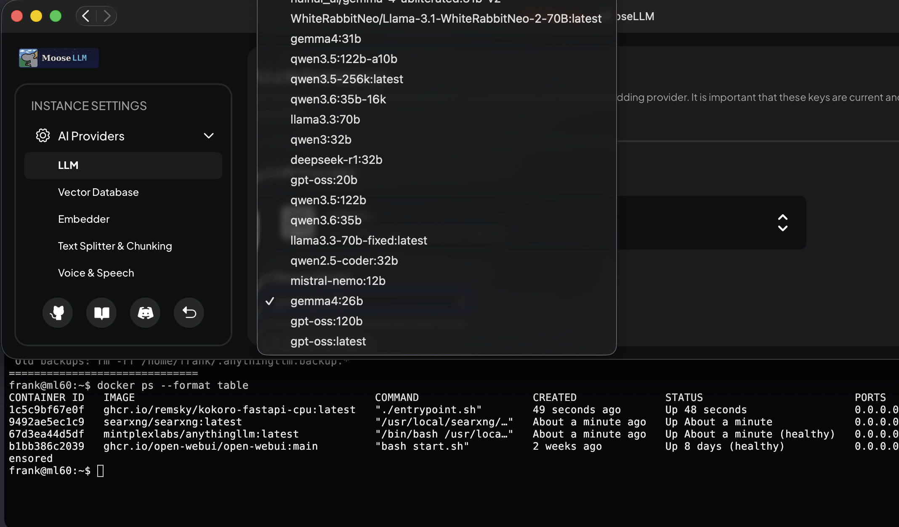
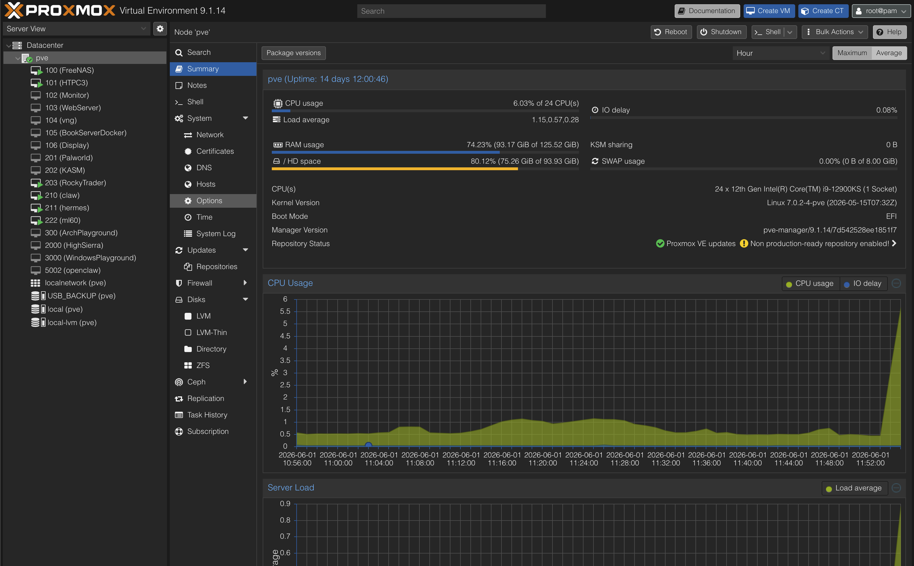

::: {.eyebrow}
Personal · Self-hosted infrastructure
:::

::: {.trader-gallery}

{.gallery-lead group="ml-infra"}

::: {.trader-thumbs .three-thumbs}

{group="ml-infra"}

{group="ml-infra"}

{group="ml-infra"}

:::

:::

## What it does

A self-hosted ML platform running entirely on my own hardware — local LLM
serving, retrieval, agents, and multimodal generation, all local-first by
default. Cloud providers (Anthropic, Google) are a pluggable option, not
a dependency.

- **Local LLM serving** — a central inference VM runs Ollama as the model
  server, keeping several models resident at once (Qwen3.6, Gemma4, Llama
  3.3 70B, GPT-OSS 120B, and others) and tuned for concurrency so multiple
  clients hit it in parallel.
- **Retrieval-augmented generation** — MooseLLM (a rebranded AnythingLLM)
  and OpenWebUI are the chat and RAG front ends, wired to a self-hosted
  SearXNG instance so retrieval stays in-house, with no third-party search
  or embedding API in the loop.
- **Agent serving** — several agents run as their own services against the
  local endpoint: a Telegram-gateway assistant, the classifier behind my
  job-search funnel, and Trader Advisor. All call the same local backend.
- **Multimodal** — KokoroTTS for speech synthesis, and a separate node
  running ComfyUI for diffusion.

This is the same infrastructure discipline I brought to Ditali, my team's
ML platform at AstraZeneca — model serving, data flow, and service
orchestration — applied to a system I own end to end.

## How it's built

- **Proxmox host + standalone GPU node** — ML services run as VMs and containers
  on a Proxmox host, alongside storage and other workloads, with a second
  machine dedicated to diffusion.
- **GPU passthrough** — PCIe passthrough gives VMs direct GPU access: the
  primary host pairs an i9-12900KS with an RTX Pro 6000 Blackwell (96 GB);
  a secondary node runs an RTX 3090. I've also run AMD ROCm on an R9700,
  so the stack has been exercised across both CUDA and ROCm.
- **Networking and storage** — per-VM NIC passthrough, link-aggregated
  NICs on the NAS, and ZFS underneath for storage integrity.

## How it got here

The platform grew out of years of iteration: it started on a Dell R710
running ESXi, migrated to Proxmox on a Skylake-era box (which stuck), and
went through a long series of upgrades — recovering from ZFS pool
corruption, expanding GPU passthrough, power-managing a Thunderbolt eGPU —
before reaching the current 12900KS + RTX Pro 6000 host. Each step taught
something that maps directly onto building and operating real ML
infrastructure: virtualization, hardware and driver debugging, storage
reliability, and service orchestration.
