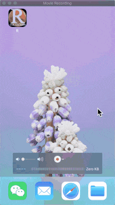
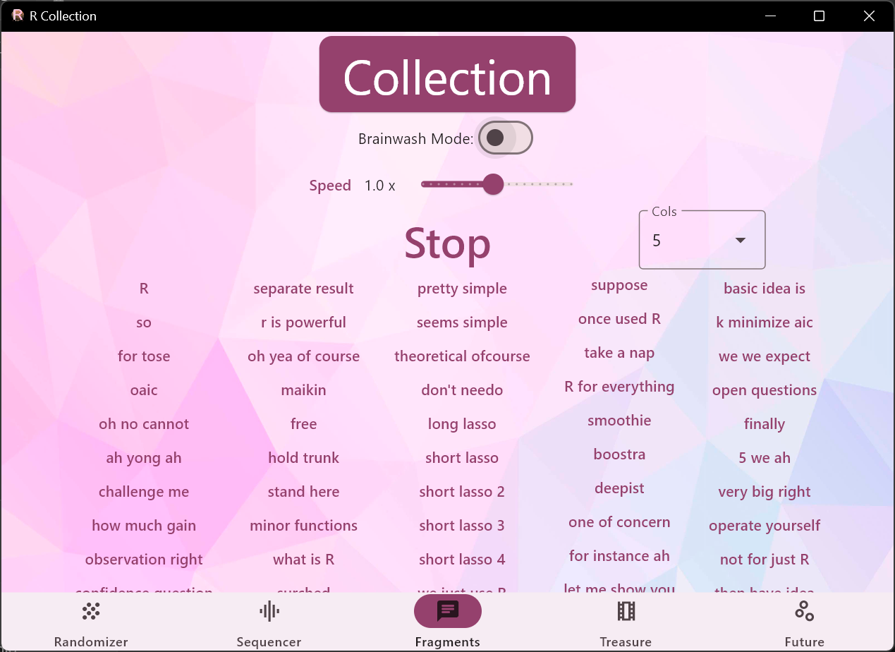

::: {.eyebrow}
Personal project
:::

```{=html}
<div style="display:grid; grid-template-columns:160px 1fr 1fr; gap:1rem; align-items:end; margin:1rem 0;">
<div>

<div style="font-family:'JetBrains Mono', monospace; font-size:0.7rem; letter-spacing:0.12em; text-transform:uppercase; color:#8b949e; margin-top:0.4rem;">Swift · iOS</div>
</div>
<div>
<picture>
<source srcset="../assets/img/projects/soundboard-macos.webp" type="image/webp">

</picture>
<div style="font-family:'JetBrains Mono', monospace; font-size:0.7rem; letter-spacing:0.12em; text-transform:uppercase; color:#8b949e; margin-top:0.4rem;">Flutter · macOS</div>
</div>
<div>
<picture>
<source srcset="../assets/img/projects/soundboard-windows.webp" type="image/webp">

</picture>
<div style="font-family:'JetBrains Mono', monospace; font-size:0.7rem; letter-spacing:0.12em; text-transform:uppercase; color:#8b949e; margin-top:0.4rem;">Flutter · Windows</div>
</div>
</div>
```

## Idea

A soundboard app with audio mixing, shuffling, video playback, and motion
control. Started life as a Swift 5 iOS prank app — sounds you trigger to
mess with friends. Once it became fun to use, I rewrote it in Flutter to
ship the same UI on macOS, Windows, and Linux from a single codebase.

## Implementation

- **Original** — Swift 5 / iOS, with motion sensors driving sample
  triggers.
- **Rewrite** — Flutter and Dart for cross-platform desktop targets.
  GitHub Actions produces Linux binaries alongside the macOS and Windows
  builds, so a tagged release ships all three at once.

Source clips for the soundboard are produced by the small companion
[audio cutter](audio-cutter.qmd) tool — extracting audio fragments by
time interval from a curated set of videos.

## Stack

Swift 5 (original iOS), Flutter + Dart (cross-platform rewrite).
Animations built in Adobe After Effects; icon work in Affinity Photo. All
audio assets are royalty-free.

[GitHub repository →](https://github.com/mizaimao/r_flutter){.external}
