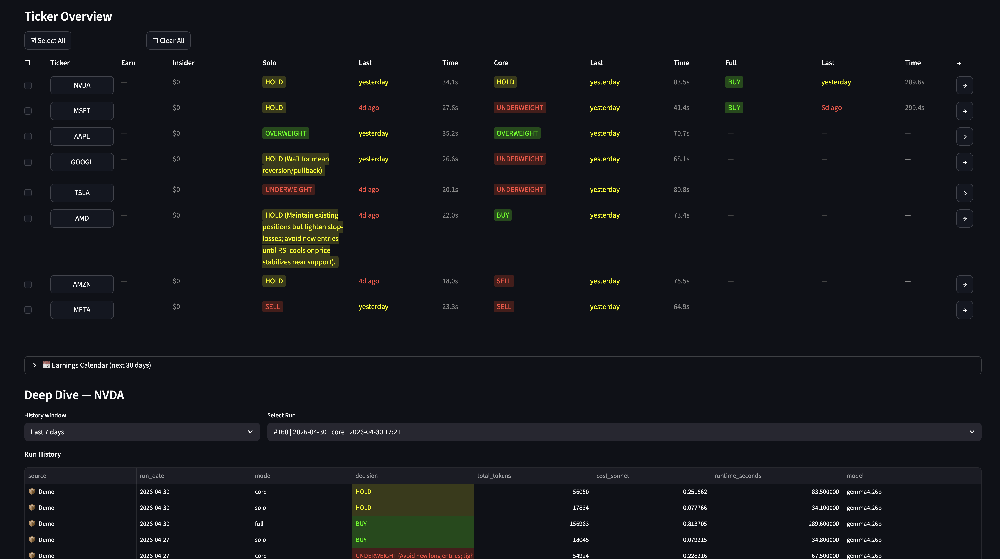

::: {.eyebrow}
Personal project · 2026
:::

## Idea

Most LLM "stock analyst" demos are single-call: dump the data, ask for a verdict.
The model never has to decide *what* data to look at, because everything is
pre-fetched. This project flips that — an agent that picks its own tools during
the investigation, calling for price context, indicators, options, sentiment,
or fundamentals based on what it has already learned. The agent's reasoning
trace is the artifact, not just the verdict.

Four modes ship together: the agent, two classical LLM pipelines (solo,
core), and a wrapper around the open-source TradingAgents framework. The
same ticker can be looked at four ways.

## Implementation

- **Agent loop** — hand-rolled tool-calling loop, no LangChain or LangGraph.
  Persistent message history, ephemeral system prompt rebuilt each turn with
  the current call budget, force-finalize on budget exhaust via
  `tool_choice="none"`. Eleven tools span price action, technical indicators,
  fundamentals, options flow, insider transactions, news, sector
  comparisons, and social sentiment.
- **Other modes** — *solo* is one LLM call with all data dumped in (baseline).
  *Core* is a three-step adversarial workflow (analyst → challenger →
  synthesizer); flips ~30% of solo's verdicts. *Full* wraps the open-source
  TradingAgents framework for a seven-agent debate.
- **Inference** — primary path is locally hosted gpt-oss:20b via Ollama on a
  single RTX 3090 (24GB). Provider-pluggable: provider abstraction designed
  for Anthropic, OpenAI, and Google Generative AI; primary deployed path is
  Ollama.
- **Frontend** — Streamlit dashboard with three tabs (Overview, Run Explorer,
  About) and a modal-driven run configurator. The agent trace renderer shows
  each step's reasoning, the tool called, and the truncated tool result —
  legible as a journal of the investigation.
- **Persistence** — every run journaled to SQLite: prompts, tool calls, token
  cost, runtime, decision rationale.

## Demo

[Hugging Face Spaces →](https://huggingface.co/spaces/DonkeyTheMoose/trader-advisor){.external}

The deployed demo runs in read-only mode (pre-loaded analyses, live runs
disabled because the agent needs Finnhub, Alpha Vantage, and an LLM key).
The Run Explorer tab and agent trace viewer are fully interactive over the
pre-loaded data.

## Stack

Python, Ollama, Streamlit, SQLite, Plotly. Provider abstraction designed for
Anthropic, OpenAI, and Google Generative AI; primary deployed path is Ollama.

[GitHub repository →](https://github.com/mizaimao/trader-advisor){.external}
