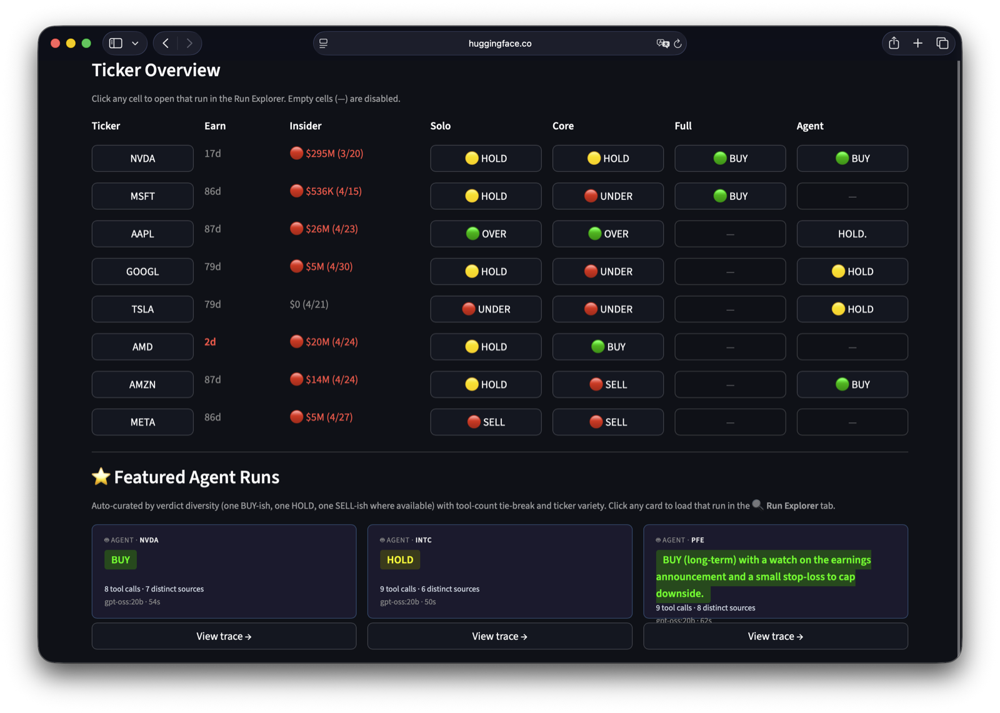
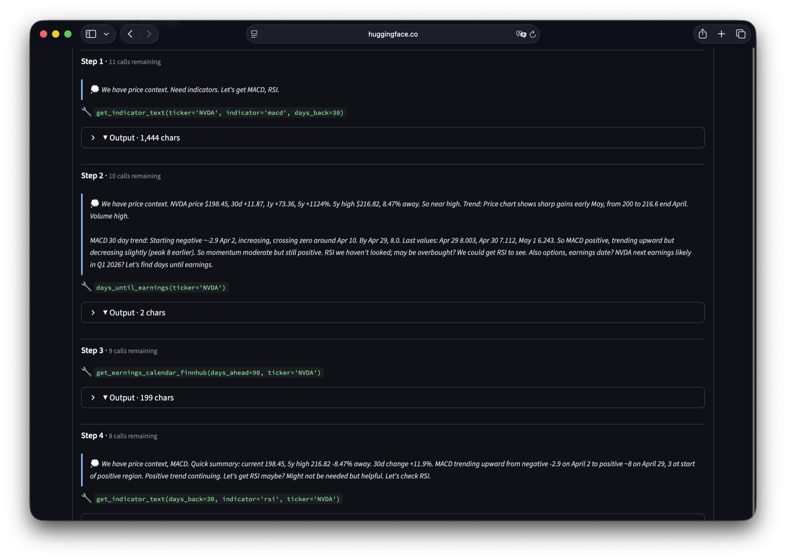
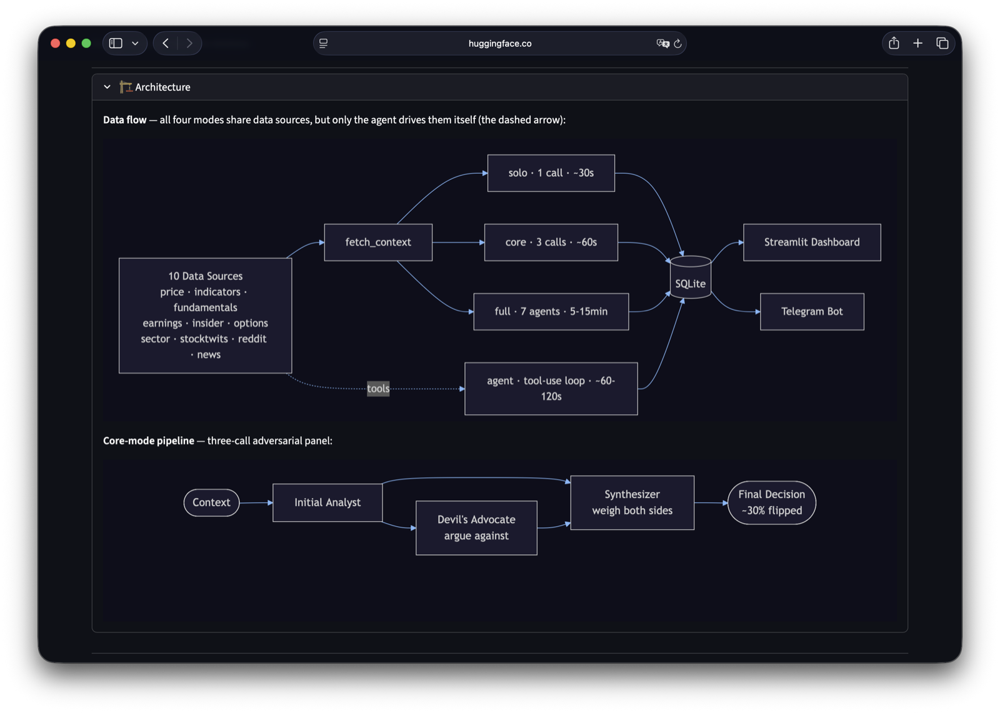
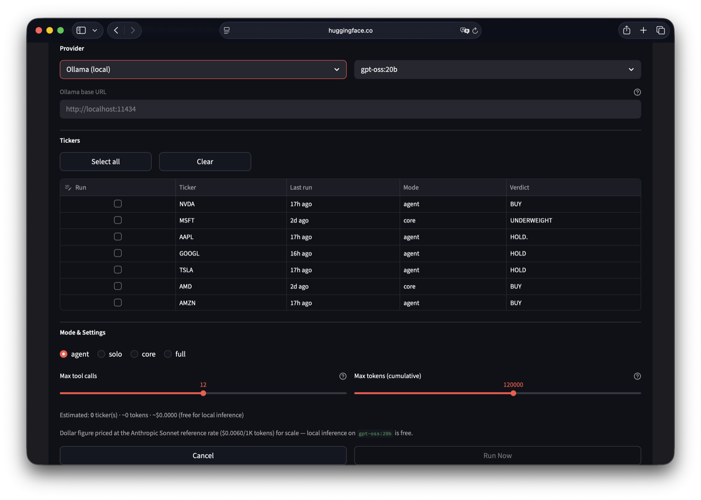
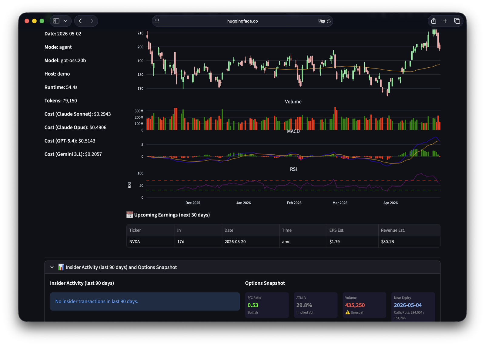
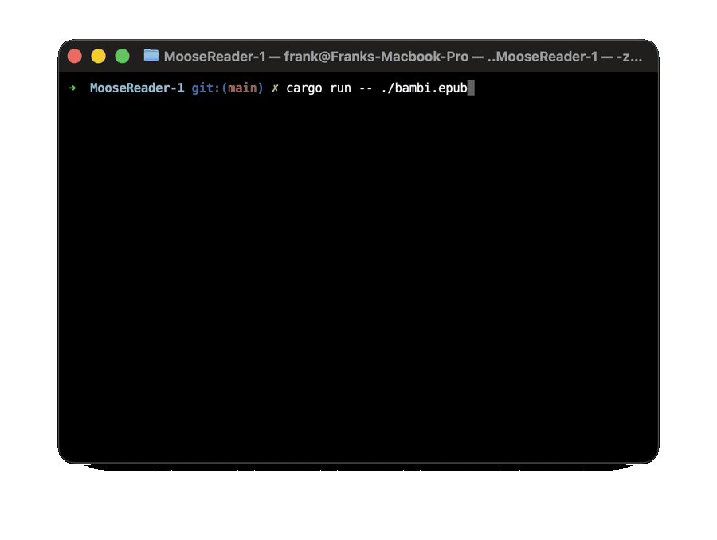
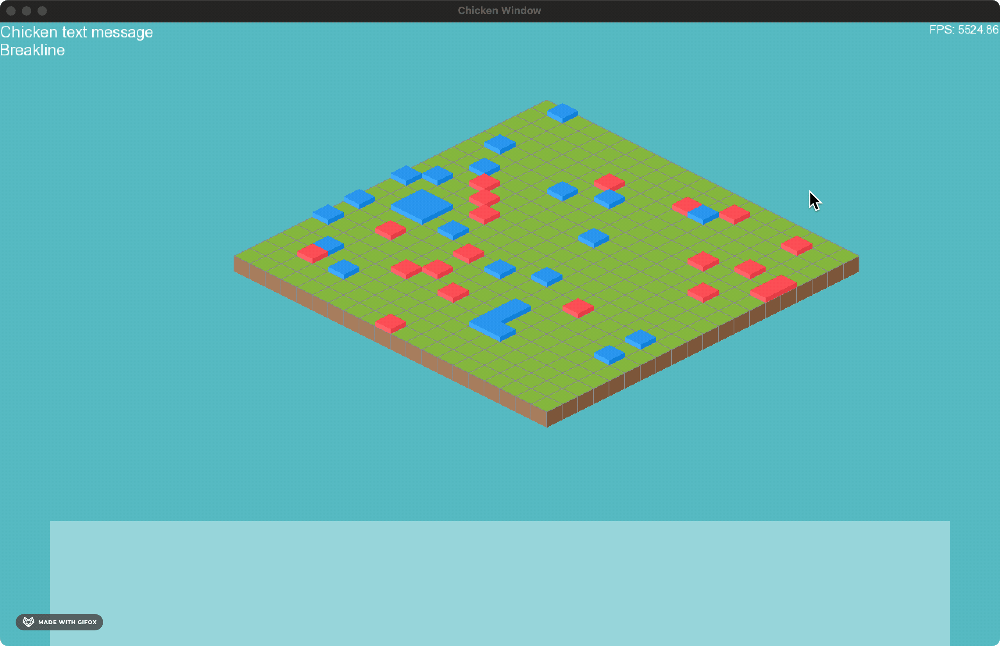
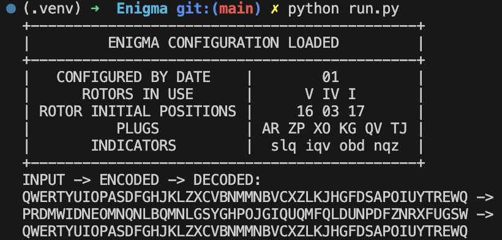
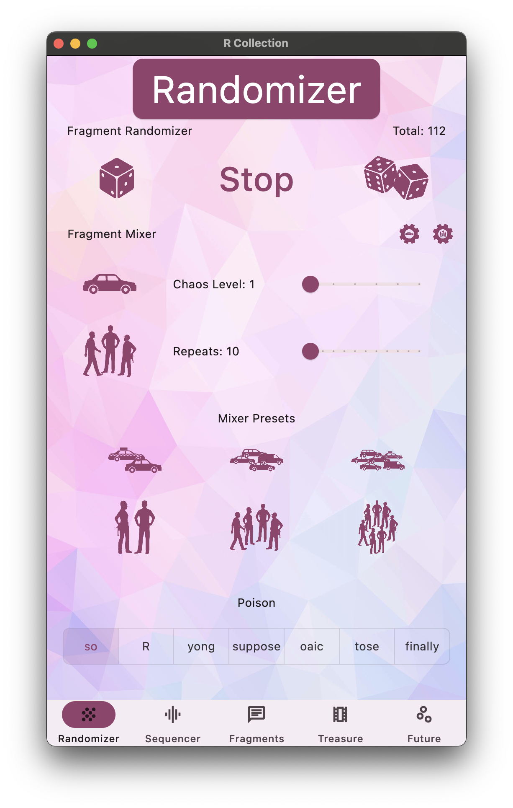
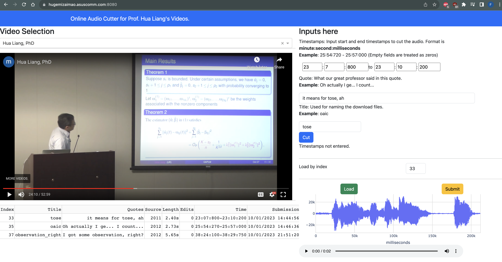

::: {.eyebrow}
§ Personal · Outside the day job
:::

The stuff I build for the fun of figuring it out — generative models,
agentic exploration, game-related stuffs, terminal toys, and small
simulations.

For professional work, see [Work](projects.qmd).

::: {.experiment-row}

::: {.experiment-text}
<div class="experiment-meta">2026 · Agentic AI · Python · Streamlit</div>

### [Trader Advisor — agentic stock research](projects/trader-advisor.qmd)

An LLM agent that researches stocks by autonomously calling tools — picks
its own data sources during the investigation, with a tool-call quota and
hand-rolled loop (no LangChain). Eleven tools spanning price, indicators,
fundamentals, options, insider activity, sentiment, and news. Two
classical LLM pipelines included as additional voices. Runs locally on
gpt-oss:20b via Ollama; provider-pluggable for Anthropic, OpenAI, Google.

<div class="experiment-links">
[Read more →](projects/trader-advisor.qmd) ·
[Hugging Face Spaces →](https://huggingface.co/spaces/DonkeyTheMoose/trader-advisor){.external} ·
[GitHub](https://github.com/mizaimao/trader-advisor){.external}
</div>
:::

::: {.experiment-media}

::: {.trader-gallery}

{.gallery-lead group="tinkering-trader-advisor"}

::: {.trader-thumbs}

{group="tinkering-trader-advisor"}

{group="tinkering-trader-advisor"}

{group="tinkering-trader-advisor"}

{group="tinkering-trader-advisor"}

:::

:::

:::

:::

::: {.experiment-row}

::: {.experiment-text}
<div class="experiment-meta">2024 · Generative Models · PyTorch</div>

### [Music generation transformer](projects/music-gen.qmd)

Decoder-only generative transformer in PyTorch — small enough to be readable,
big enough to learn something interesting. Dual-modality: text tokenizer for
language modeling, MIDI tokenizer for music generation. Trained on Bach's
*Goldberg Variations* and *The Well-Tempered Clavier*.

<div class="experiment-links">
[Read more →](projects/music-gen.qmd) ·
[GitHub](https://github.com/mizaimao/DecoderTest){.external}
</div>
:::

```{=html}
<div class="experiment-media">
<div class="audio-stack">
<div>
<audio controls preload="none">
<source src="assets/audio/gen_gold_overfit_2.mp3" type="audio/mpeg">
</audio>
<div class="audio-caption">Goldberg Variations · 1</div>
</div>
<div>
<audio controls preload="none">
<source src="assets/audio/gen_gold_overfit_3.mp3" type="audio/mpeg">
</audio>
<div class="audio-caption">Goldberg Variations · 2</div>
</div>
<div>
<audio controls preload="none">
<source src="assets/audio/gen_clavier_chicken.mp3" type="audio/mpeg">
</audio>
<div class="audio-caption">Well-Tempered Clavier</div>
</div>
</div>
</div>
```

:::

::: {.experiment-row}

::: {.experiment-text}
<div class="experiment-meta">2026 · Terminal · Rust</div>

### [MooseReader](projects/moose-reader.qmd)

A featherweight terminal EPUB reader in Rust — keyboard-driven (`h` `j`
`k` `l`), TrueColor themes (Dracula, Nord, Solarized, Catppuccin,
Gruvbox), and percentage-based bookmarks. No electron shell, no
heavyweight TUI framework — single-digit-megabyte footprint.

<div class="experiment-links">
[Read more →](projects/moose-reader.qmd) ·
[GitHub](https://github.com/mizaimao/MooseReader){.external}
</div>
:::

```{=html}
<div class="experiment-media">

</div>
```

:::

::: {.experiment-row}

::: {.experiment-text}
<div class="experiment-meta">2022 · Simulation · Python · C++</div>

### [Isometric tiles](projects/isometric-tiles.qmd)

A Game-of-Life-inspired tile simulation. Blue and red blocks move,
multiply, and decay over an isometric grid. Written in Python first, then
ported to C++ for larger grids and faster step rates.

<div class="experiment-links">
[Read more →](projects/isometric-tiles.qmd) ·
[GitHub — Python](https://github.com/mizaimao/ColonySim){.external} ·
[GitHub — C++](https://github.com/mizaimao/ColonySimR){.external}
</div>
:::

```{=html}
<div class="experiment-media">

</div>
```

:::

::: {.experiment-row}

::: {.experiment-text}
<div class="experiment-meta">2023 · Cryptography · Python</div>

### [Enigma machine emulator](projects/enigma.qmd)

Object-oriented Python 3 emulation of the Enigma M3 cipher machine, with
rotors, reflectors, and the plugboard modeled as first-class classes.
Settings are reproducible — encrypt-then-decrypt round trips verify cleanly.

<div class="experiment-links">
[Read more →](projects/enigma.qmd) ·
[GitHub](https://github.com/mizaimao/Enigma){.external}
</div>
:::

```{=html}
<div class="experiment-media">
<picture>
<source srcset="assets/img/projects/enigma.webp" type="image/webp">

</picture>
</div>
```

:::

::: {.experiment-row}

::: {.experiment-text}
<div class="experiment-meta">2023 · Graphics · Python</div>

### [Raycasting renderer](projects/raycasting.qmd)

A from-scratch raycasting renderer in Python and PyQt5 — the rendering
technique behind *Wolfenstein 3D* (1992). Casts rays per pixel column over a
2D map and computes wall heights from intersection distance.

<div class="experiment-links">
[Read more →](projects/raycasting.qmd) ·
[GitHub](https://github.com/mizaimao/raycasting_pyqt){.external}
</div>
:::

```{=html}
<div class="experiment-media portrait">

</div>
```

:::

::: {.experiment-row}

::: {.experiment-text}
<div class="experiment-meta">2019 · Game Engines · Unreal</div>

### [Unreal Engine cutscene experiment](projects/unreal-engine.qmd)

A video cutscene and physics-driven object-movement experiment in Unreal
Engine 4.22, with raytracing enabled. Built from royalty-free assets —
the focus was the scripting and rendering pipeline rather than original
art.

<div class="experiment-links">
[Read more →](projects/unreal-engine.qmd)
</div>
:::

```{=html}
<div class="experiment-media">
<div style="position:relative; padding-bottom:56.25%; height:0; overflow:hidden; border:1px solid #30363d; border-radius:4px;">
<iframe src="https://www.youtube.com/embed/kLks7bYS2z8" style="position:absolute; top:0; left:0; width:100%; height:100%;" frameborder="0" allow="picture-in-picture; encrypted-media" allowfullscreen></iframe>
</div>
</div>
```

:::

::: {.experiment-row}

::: {.experiment-text}
<div class="experiment-meta">2024 · Mobile · Flutter · Swift</div>

### [Soundboard app](projects/soundboard.qmd)

A cross-platform soundboard with audio mixing, shuffling, video playback,
and motion control. Started as a Swift 5 iOS prank; rewritten in Flutter
to ship the same UI on macOS, Windows, and Linux from one codebase.

<div class="experiment-links">
[Read more →](projects/soundboard.qmd) ·
[GitHub](https://github.com/mizaimao/r_flutter){.external}
</div>
:::

```{=html}
<div class="experiment-media">
<picture>
<source srcset="assets/img/projects/soundboard-macos.webp" type="image/webp">

</picture>
</div>
```

:::

::: {.experiment-row}

::: {.experiment-text}
<div class="experiment-meta">2023 · Web · Python</div>

### [Online audio cutter](projects/audio-cutter.qmd)

A small Dash web service that extracts audio clips from pre-defined
videos by time interval. Built to feed source material into the
Soundboard app without round-tripping through a desktop editor.

<div class="experiment-links">
[Read more →](projects/audio-cutter.qmd) ·
[GitHub](https://github.com/mizaimao/audio_cutter){.external}
</div>
:::

```{=html}
<div class="experiment-media">
<picture>
<source srcset="assets/img/projects/audio-cutter.webp" type="image/webp">

</picture>
</div>
```

:::
